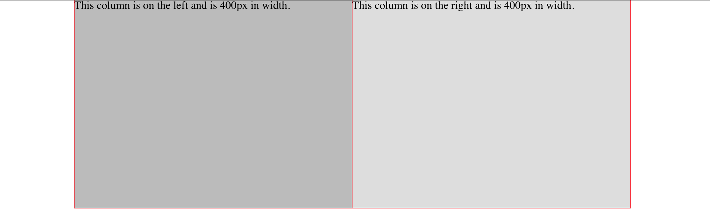
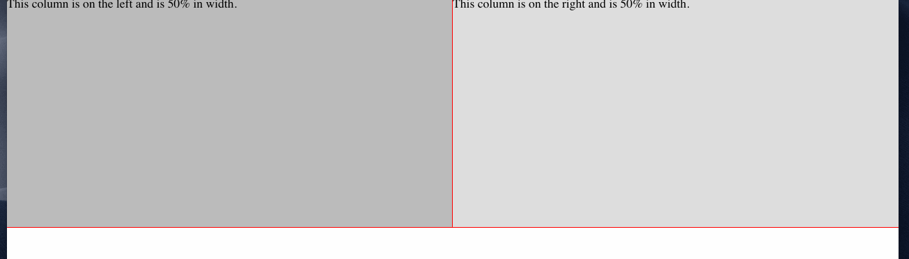
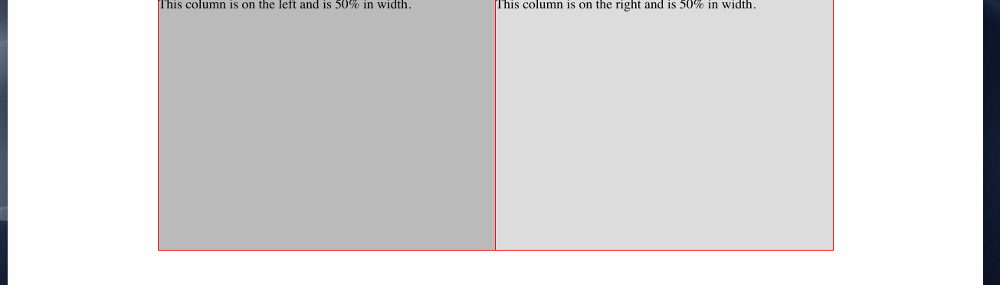

# Exercises

## Two Columns, Centered, Fixed in Size

Here is what you are going for.

[Starter HTML without CSS](https://codepen.io/mallioch/pen/XoBaJv?editors=1100#0)

[Example with CSS](https://codepen.io/mallioch/pen/gLaaeY?editors=1100#0), in case you get stuck.

## Two Columns, Flexible Width

Use percentages instead of fixed pixel widths for flexible layouts.

[Starter HTML without CSS](https://codepen.io/mallioch/pen/NeBvrB?editors=1100)

[Example with CSS](https://codepen.io/mallioch/pen/ObyyQJ?editors=1100#0)

## Two Columns, Flexible, Centered

Combine the techniques of centering and percentage-based layouts!

[Starter HTML without CSS](https://codepen.io/mallioch/pen/aPjyBv?editors=1100#0)

[Example with CSS](https://codepen.io/mallioch/pen/woKKXK?editors=1100#0)

