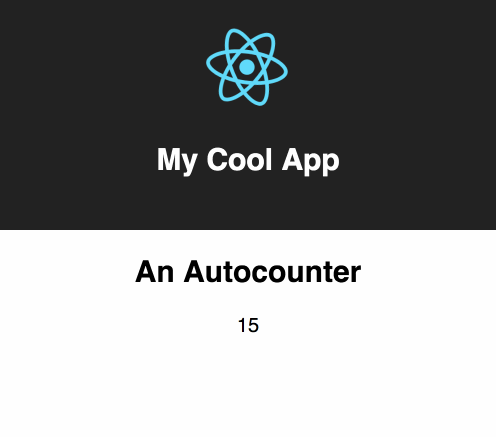

# Introduction

In this part of the lab we will get familiar with create-react-app and making basic React components.

## Section 1: The Tour

In this section we take a look around an app created with create-react-app.

**Activity**

* Change some text in the app and make sure you see the change in your browser.
* Make some invalid markup (maybe don't close a tag) and see the error. Then fix it.

**Video**

<video src="https://s3-us-west-2.amazonaws.com/nddg-vids/lesson-01-a-intro.mp4" style="max-width: 60%;" controls></video>

## Section 2: Our First Component

Here we'll create our first component.

**Activity**

* Create your own autocounter component

This is what we're going to build today.

**Video**

<video src="https://s3-us-west-2.amazonaws.com/nddg-vids/lesson-01-b-first-component.mp4" style="max-width: 60%;" controls></video>

## Section 3: Introducing Props

Props allow you to pass values into components, an essential bit of knowledge.

**Activity**

* Pass a header value into your autocounter component and render that in the component.

**Video**

<video src="https://s3-us-west-2.amazonaws.com/nddg-vids/lesson-01-c-props.mp4" style="max-width: 60%;" controls></video>
