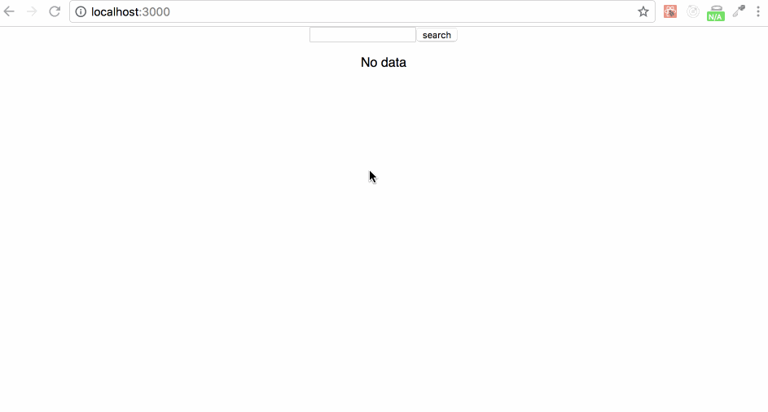

## A React Challenge

We've learned a lot of scattered bits about React. Time to pull a lot of those things together and build something. It should look something like this:

## The Rundown

1.  Use the same API as before, though with a different path: http://cpsc-api.herokuapp.com/api/search?q=lead
1.  Build an interface that includes an input, a button, and a table for data. The user needs to be able to enter a search query in the input, click the button to search, and then see matching data. The example url above shows an example where someone searched for "lead" (as in the metal).
1.  Feel free to style it as you wish.
1.  Use conditional rendering to show a message about no data when there is none (for example, in the default state or if someone's search doesn't return anything)

If you want to see somebody build this, here's a video:

<video src="https://s3-us-west-2.amazonaws.com/nddg-vids/react-challenge.mp4" style="max-width: 60%;" controls></video>